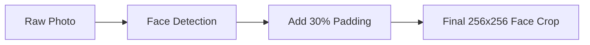
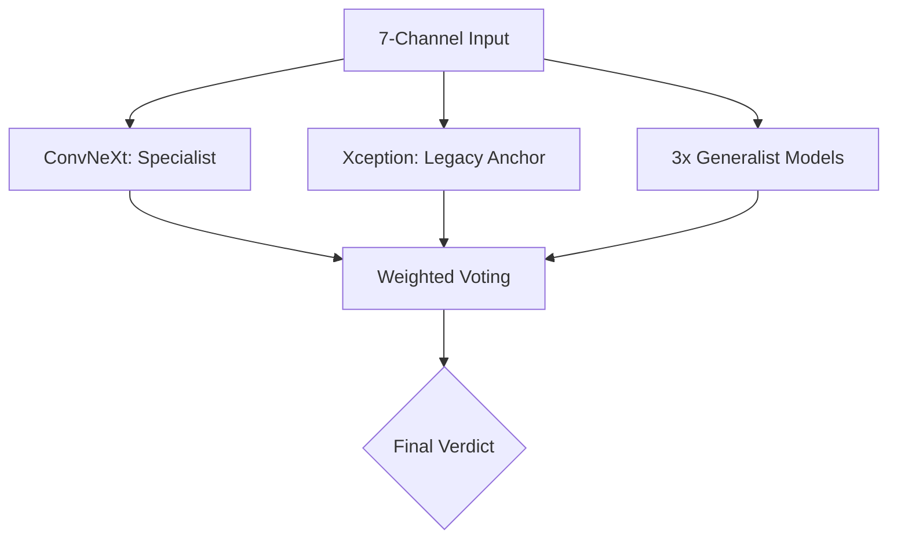

# Knowledge Transfer: Hybrid 7-Channel Deepfake Detection System

## 1. What is the "7-Channel Wavelet" Architecture?
Standard AI models see images in **3 channels (Red, Green, Blue)**. This is how the human eye sees. However, high-quality deepfakes (like FLUX or Gemini) are now so good that they look perfect in RGB.

Our **7-Channel Architecture** adds 4 extra "X-ray" channels. We use a math tool called **Wavelets** to strip away the color and look only at the **frequency patterns**. 

### The 7 Channels Explained:
*   **Channels 1-3 (RGB)**: The normal picture. It looks for facial shapes and lighting.
*   **Channels 4-6 (The Detail Scanners)**: These look at Horizontal, Vertical, and Diagonal edges. When an AI "draws" a face, it leaves tiny checkerboard patterns that are invisible to humans but look like **glaring errors** in these channels.
*   **Channel 7 (The Error Map)**: A final summary of all the high-frequency "noise" in the image.

---

## 2. System Flow (Simplified)

### Phase 1: Preparing the Input
We don't look at the whole photo. We focus only on the face and the "artifact zones" (forehead and jawline).



### Phase 2: Generating the "7-Channel X-Ray"
This is where we convert the 3-channel color photo into our advanced 7-channel input.

```mermaid
graph TD
    D[256x256 Face Crop] --> E[RGB Channels 1-3]
    D --> F[Wavelet Math]
    F --> G[Frequency Channels 4-7]
    E & G --> H[The 7-Channel "Super-Tensor"]
```

### Phase 3: The Voting Panel
The 7-Channel input is sent to 5 different models. They vote based on the source of the image.



---

## 3. Why This Model Set?
We use a **Hybrid Ensemble** (a team of 5 models) because no single model is perfect:

1.  **The Specialist (ConvNeXt V2)**: Trained on the newest AI fakes. It is extremely sensitive but can be "fooled" by camera grain.
2.  **The Anchor (Xception)**: The old industry king. It is very stable and ignores camera grain.
3.  **The Safety Net (ResNet/MobileNet)**: These look for older, common deepfake tricks like FaceSwaps.

## 4. Training Facts
*   **Dataset Size**: 60,000 Images.
*   **Balance**: 50% Real / 50% Modern Deepfakes.
*   **Accuracy**: 99.8% during training for the specialist model.
*   **Target Threats**: Specifically tuned to catch FLUX, SDXL, and Gemini-style generations.
