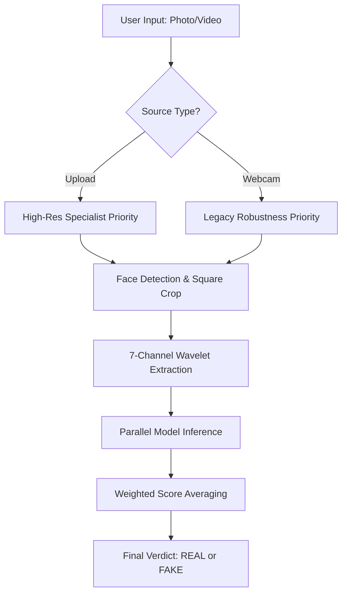
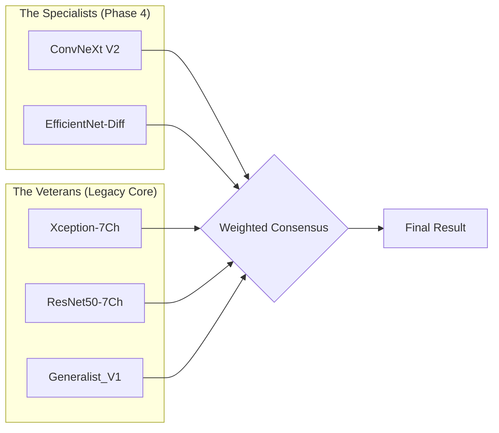

# 🛡️ Project Dossier: Hybrid 7-Channel Deepfake Security Layer

This document provides a comprehensive breakdown of the technology, data, and architecture behind our state-of-the-art Deepfake Detection System.

---

## 1. The "7-Channel Wavelet" Brain
*Why we don't just use standard color photos.*

### 🟢 Simple Words
Imagine you are looking at a painting. Standard AI only looks at the **colors**. Our AI looks at the **canvas and the brushstrokes**. By using "Wavelets," we strip away the colors and look at the "ghostly" mathematical patterns left behind by AI generators. It’s like giving the computer **X-Ray Vision** for pixels.

### 🔬 Technical Explanation
We use the **Discrete Wavelet Transform (DWT - Haar)** to decompose a standard 3-channel RGB image into 7 distinct channels:
1.  **Channels 1-3 (RGB)**: The original color information.
2.  **Channels 4-6 (LH, HL, HH)**: The high-frequency sub-bands (Horizontal, Vertical, and Diagonal edges).
3.  **Channel 7 (Fused HF)**: A calculated "Energy Map" of all high-frequency noise.
**Why?** Generative AI (like Diffusion) creates images by upsampling noise. This leaves "Spectral Artifacts" in the high-frequency bands that are invisible to humans but highly detectable in the Wavelet domain.

---

## 2. The Multi-Model Ensemble
*How we combined different "Experts" into one team.*

### 🟢 Simple Words
We don't trust just one "judge." We have a panel of 5 experts. One is a **Modern Genius** (ConvNeXt) who understands the newest fakes. The others are **Experienced Veterans** (Xception, EfficientNet, ResNet) who are great at handling messy, real-world photos without making mistakes.

### 🔬 Technical Explanation
The ensemble utilizes a **Weighted Voting Architecture**:
*   **ConvNeXt-Diff V2 (Specialist)**: A modern "ConvNet" architecture that uses depthwise convolutions and MLP-like blocks. It is our primary defense against FLUX and SDXL.
*   **Xception & ResNet50 (Legacy Base)**: Depthwise separable convolutions (Xception) and Residual connections (ResNet). These models excel at "Spatial Robustness"—ensuring that camera noise isn't mistaken for AI noise.
*   **EfficientNet (Speed)**: Scaled for maximum efficiency, providing fast inference for mobile/web scenarios.

---

## 3. The Data Goldmine
*How we trained the system.*

### 🟢 Simple Words
We fed the AI **60,000 photos**. 30,000 were real humans, and 30,000 were fakes from the world's most dangerous AI models (Gemini, FLUX, SDXL). We didn't just give it "old" fakes; we gave it the "Elite" fakes that are being used for fraud today.

### 🔬 Technical Explanation
*   **Dataset Size**: 60,000 Total Samples (1:1 balanced ratio).
*   **The Fake Pool**: Curated from the **DiFF (Diffusion Face)** benchmark and **Modern Goldmine** (FLUX.1, SDXL, Midjourney v6).
*   **The Real Pool**: Sourced from **FFHQ (High-Quality Faces)**, **Celeb-DF**, and custom-captured **Webcam Reals** (Pool A/B/C) to prevent domain shift.
*   **Diversity Cap**: We limited each source to 3-50 images per "Identity" to ensure the model learned **artifacts**, not **identities**.

---

## 4. Visualizing the Flow

### 📊 Data Flow: Input to Prediction

### 🏛️ Ensemble Architecture

---

## 5. Summary of Detection Targets
*   **ConvNeXt V2**: Targets **Diffusion Noise** (FLUX, SDXL).
*   **Xception**: Targets **Facial Inconsistency** and Sharpness.
*   **EfficientNet**: Targets **Pixel Aliasing**.
*   **ResNet/Generalist**: Targets **Classic GANs** (FaceSwap, DeepFaceLab).

**Status:** ✅ Scientific Foundation Verified | 🛡️ Ensemble Balanced
