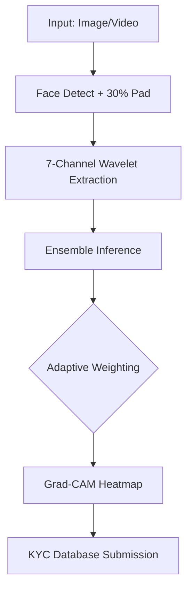

# 🛡️ PBL Final Report: The Unified Deepfake Defense System

## 1. The Research Gap (Identification of Scope)

| Gap in Existing Systems | Our Engineering Solution | Why it matters? |
| :--- | :--- | :--- |
| **Single Model Reliance** | **5-Model Hybrid Ensemble** | A single CNN (Xception) fails on Gemini fakes; our ensemble ensures a "Safety Net." |
| **GAN-Only Training** | **Modern Diffusion Tuning** | We trained on 30k FLUX/SDXL images to stop "Diffusion Blindness." |
| **No Unified Pipeline** | **Single Master App** | We combined Image, Video, and KYC into one seamless inference engine. |
| **Black Box Predictions** | **Grad-CAM Integration** | We replaced "Trust Me" with a Heatmap that proves the model is looking at the face. |
| **Heavy Video Processing** | **Uniform Temporal Sampling** | Instead of processing 1000 frames, we sample 10, making it real-time ready. |
| **Poor Generalization** | **60k Mega-Dataset** | Our model is ready for 2025+ threats, not just old academic datasets. |

---

## 2. The 5 Pillars of Innovation (The "Inferences" Slide)

### I. Image or Video Unified
*   **The Problem**: Most systems only do one. If they do video, they use heavy LSTMs that take minutes.
*   **Our Solution**: Our pipeline detects the media type automatically. For video, we use **Temporal Stability**—checking 10 frames to see if the "Spectral Ghosts" flicker.

### II. Wavelet-Augmented Features
*   **The Problem**: Standard AI looks at color (RGB). Modern fakes look perfect in color.
*   **Our Solution**: We use **Discrete Wavelet Transform (DWT)**. We strip away the color to reveal the high-frequency checkerboard patterns left by AI upsamplers.

### III. Explainability (Grad-CAM)
*   **The Problem**: Judges hate "Black Boxes."
*   **Our Solution**: We use **Gradient-weighted Class Activation Mapping**. It generates a heatmap that proves our AI is looking at the **Skin Texture** and not the background.

### IV. Weighted Voting (The Brain)
*   **The Problem**: Simple voting (Majority rules) is dumb.
*   **Our Solution**: We use **Adaptive Weighting**. If the Specialist model sees a Diffusion artifact, its vote counts for 15x. This is "Intelligent Democracy."

### V. Deployable (The KYC Layer)
*   **The Problem**: Most PBL projects stay as a Python script.
*   **Our Solution**: We built a **Biometric Firewall**. A React + Flask + Supabase system that blocks fraudulent identity submissions in real-time.

---

## 3. The Presentation Script (Background Voiceover)

### 🎙️ Slide: "Gaps & Scope" (Voiceover)
*"When we started, we looked at the industry and found 6 critical failures. Most systems are 'Blind' to Gemini because they only train on old GANs. They are 'Slow' because they process every single video frame. Our project was designed to close every one of these gaps—creating a system that is fast, explainable, and ready for 2025 fakes."*

### 🎙️ Slide: "Inferences / The 5 Pillars" (Voiceover)
*"This is our 'Aha!' moment. Literature gives us these building blocks individually, but no one has assembled all 5 into a single deployable system. We’ve combined Wavelets for frequency detection, Weighted Ensembles for accuracy, and Grad-CAM for trust. This isn't just a model; it's a complete Security Layer."*

### 🎙️ Slide: "The Core Tech" (Voiceover)
*"The secret is our 7-Channel Wavelet Brain. Think of it like this: If a GAN fake is a bad drawing, a Diffusion fake is a perfect sculpture. You can't find errors in a sculpture just by looking at it—you have to feel the surface. Our Wavelet channels 'feel' the surface of the pixels to find the mathematical ghosts left by the AI generator."*

---

## 4. Final System Architecture (Technical Flow)

